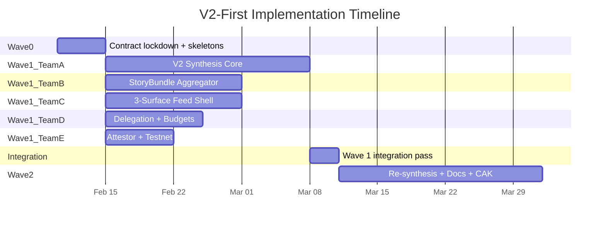
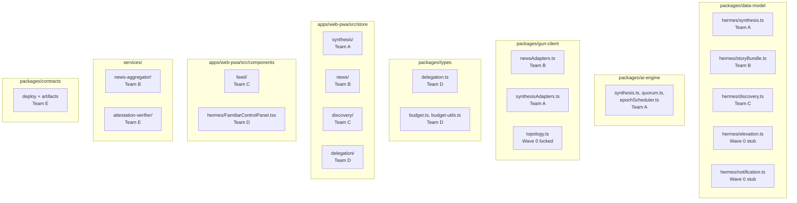
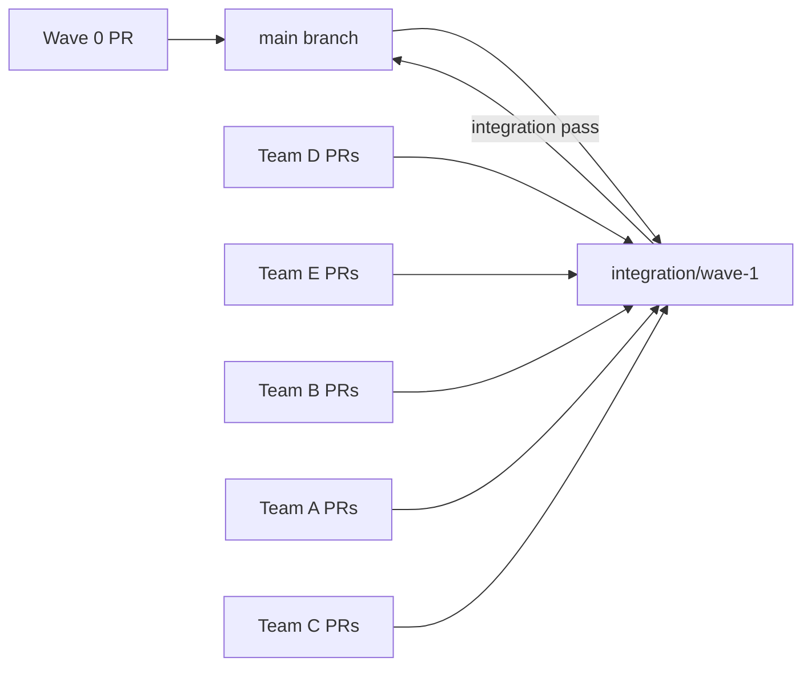

# V2-First Implementation: Staffing Matrix and Execution Plan

## Coordinator Review (2026-02-08)

This plan was refined against:

- `docs/foundational/TRINITY_Season0_SoT.md` (V2-first direction, A-G deltas)
- `docs/foundational/STATUS.md` (current implementation truth)

Key refinements applied:

1. Removed unsafe assumption that all Wave 1 teams can merge in any order.
2. Replaced risky Wave 0 barrel-edit guidance for `apps/web-pwa/src/store/index.ts` with team-local module entrypoints.
3. Added explicit V2 cutover flags to avoid destabilizing live v1-compatible flows while Wave 1 is in flight.
4. Right-sized Team E scope to "dev-truth + deployment + bridge plumbing" (not full production attestation).
5. Added rolling integration cadence (every 48h) instead of single big-bang integration at wave end.
6. Added explicit SoT/spec mapping for discovery, news aggregation, topic synthesis v2, and linked socials.

## Architecture: Wave Structure




---

## SoT A-G Coverage Map

| SoT Delta | Primary Lane | Secondary Lane |
| --- | --- | --- |
| A. V2-first synthesis | Team A (Wave 1) | W2-Alpha |
| B. 3-surface feed | Team C (Wave 1) | W2-Gamma (real social data) |
| C. Elevation loop artifacts + forwarding | W2-Gamma | Team D (budget/delegation guards) |
| D. Thread longform overflow -> Docs | W2-Beta | Team C |
| E. Collaborative docs | W2-Beta | W2-Gamma (publish/elevation handoff) |
| F. Civic signal -> value rails | Team D + Team E | W2-Alpha |
| G. Provider switching + consent | Existing baseline preserved; Team A must keep provenance | Team C (settings visibility only if needed) |

---

## Wave 0: Contract Lockdown (3-5 days)

**Purpose**: Lock shared interfaces so Wave 1 teams code against stable contracts and never collide on barrel files or topology registrations.

**Owner**: Coordinator + Chief agent (standing)

### Wave 0 Deliverables

**D0. News aggregator runtime decision (mandatory)**:

- **Decision**: Season 0 uses **Option B** for Wave 1: relay-side `news-aggregator` service publishes `StoryBundle` objects to Gun public paths; web app consumes via mesh adapters/stores.
- **Rationale**: avoids browser RSS/CORS fragility, matches current untrusted-service + local-first mesh model, and keeps the PWA runtime focused on consumption/ranking/synthesis.
- **Non-goals for Wave 1**: no direct PWA RSS ingest pipeline and no hybrid split-runtime clustering.

**D1. Shared type skeletons** -- create stub files with exported interfaces and `TODO` implementations:

- `packages/data-model/src/schemas/hermes/storyBundle.ts` -- `StoryBundle`, `FeedSource`, `RawFeedItem` (Team B will implement)
- `packages/data-model/src/schemas/hermes/synthesis.ts` -- `CandidateSynthesis`, `TopicSynthesisV2`, `TopicDigest`, `TopicSeed` (Team A will implement)
- `packages/data-model/src/schemas/hermes/notification.ts` -- `SocialNotification`, `LinkedSocialAccount` (Wave 2 will implement, Team C consumes mock)
- `packages/data-model/src/schemas/hermes/elevation.ts` -- `NominationEvent`, `NominationPolicy`, `ElevationArtifacts` (Wave 2 will implement)
- `packages/data-model/src/schemas/hermes/discovery.ts` -- `FeedItem`, `FeedKind` (Team C will implement)

**D2. Barrel file pre-registration** -- add exports to prevent merge conflicts:

- `packages/data-model/src/index.ts` -- add re-exports for all new schema files
- `packages/gun-client/src/index.ts` -- add re-exports for new adapter stubs. This requires creating the corresponding stub files so the barrel resolves at typecheck time:
  - `packages/gun-client/src/synthesisAdapters.ts` (stub -- Team A will implement)
  - `packages/gun-client/src/newsAdapters.ts` (stub -- Team B will implement)
- Do **not** pre-register exports in `apps/web-pwa/src/store/index.ts` (this file is runtime state, not a neutral barrel). Teams should expose module entrypoints under their own folders, e.g.:
  - `apps/web-pwa/src/store/discovery/index.ts`
  - `apps/web-pwa/src/store/news/index.ts`
  - `apps/web-pwa/src/store/synthesis/index.ts`
  - `apps/web-pwa/src/store/delegation/index.ts`

**D3. Topology path registration** in `packages/gun-client/src/topology.ts` (with classifications):

| Path prefix | Classification | Owner |
| --- | --- | --- |
| `vh/news/stories/*` | `public` | Team B |
| `vh/news/index/latest/*` | `public` | Team B |
| `vh/topics/*/epochs/*/candidates/*` | `public` | Team A |
| `vh/topics/*/epochs/*/synthesis` | `public` | Team A |
| `vh/topics/*/latest` | `public` | Team A |
| `vh/topics/*/digests/*` | `public` | Team A |
| `vh/topics/*/articles/*` | `public` | Wave 2 (reserved) |
| `vh/discovery/items/*` | `public` | Team C |
| `vh/discovery/index/*` | `public` | Team C |
| `vh/social/cards/*` | `public` | Wave 2 (reserved) |
| `vh/forum/nominations/*` | `public` | Wave 2 (reserved) |
| `vh/forum/elevation/*` | `public` | Wave 2 (reserved) |
| `vh/civic/reps/*` | `public` | Wave 2 (reserved) |
| `~*/docs/*` | `sensitive` | Wave 2 (reserved) |
| `~*/hermes/docs/*` | `sensitive` | Wave 2 (reserved) |
| `~*/hermes/bridge/*` | `sensitive` | Wave 2 (reserved) |

**D4. Machine-readable ownership map + branch naming contract**:

- Because Wave 1 agent clusters use shared GitHub credentials, CODEOWNERS approval identity is not a reliable enforcement mechanism.
- Create `.github/ownership-map.json` as machine-readable source of truth for file ownership zones.
- Required branch naming convention for Wave 1 PRs:
  - `team-a/*`, `team-b/*`, `team-c/*`, `team-d/*`, `team-e/*`
  - `coord/*` reserved for coordinator-approved cross-team slices only
- Example shape:

```json
{
  "team-a": {
    "branchPrefix": "team-a/",
    "paths": [
      "packages/ai-engine/src/synthesis*.ts",
      "packages/ai-engine/src/candidateGatherer.ts",
      "packages/ai-engine/src/epochScheduler.ts",
      "packages/ai-engine/src/quorum.ts",
      "packages/ai-engine/src/topicSynthesisPipeline.ts",
      "packages/data-model/src/schemas/hermes/synthesis.ts",
      "packages/gun-client/src/synthesisAdapters.ts",
      "apps/web-pwa/src/store/synthesis/**",
      "apps/web-pwa/src/hooks/useSynthesis.ts",
      "apps/web-pwa/src/components/synthesis/**"
    ]
  },
  "team-b": {
    "branchPrefix": "team-b/",
    "paths": [
      "services/news-aggregator/**",
      "packages/data-model/src/schemas/hermes/storyBundle.ts",
      "packages/gun-client/src/newsAdapters.ts",
      "apps/web-pwa/src/store/news/**"
    ]
  },
  "team-c": {
    "branchPrefix": "team-c/",
    "paths": [
      "packages/data-model/src/schemas/hermes/discovery.ts",
      "apps/web-pwa/src/store/discovery/**",
      "apps/web-pwa/src/hooks/useDiscoveryFeed.ts",
      "apps/web-pwa/src/components/feed/**"
    ]
  },
  "team-d": {
    "branchPrefix": "team-d/",
    "paths": [
      "packages/types/src/delegation*.ts",
      "apps/web-pwa/src/store/delegation/**",
      "apps/web-pwa/src/hooks/useFamiliar.ts",
      "apps/web-pwa/src/components/hermes/FamiliarControlPanel.tsx"
    ]
  },
  "team-e": {
    "branchPrefix": "team-e/",
    "paths": [
      "services/attestation-verifier/**",
      "services/bridge-stub/**",
      "packages/contracts/scripts/**",
      "packages/contracts/deployments/**"
    ]
  }
}
```

**D5. Integration branch and CI enforcement**:

- Create `integration/wave-1` from `main`. All Wave 1 PRs target this branch. Merge to `main` only after Wave 1 integration pass.
- **CI trigger update (mandatory)**: The current `.github/workflows/main.yml` only runs on `main` pushes and PRs targeting `main`. Update the trigger to also cover integration branches:

```yaml
on:
  push:
    branches: [ main, 'integration/wave-*' ]
  pull_request:
    branches: [ main, 'integration/wave-*' ]
```

- **Ownership scope CI gate (mandatory)**:
  - Add a dedicated CI job/status check: `Ownership Scope`.
  - Implement via script (for example `tools/scripts/check-ownership-scope.mjs`) that:
    - reads `.github/ownership-map.json`,
    - reads PR head branch (`team-a/*` ... `team-e/*`),
    - computes changed files,
    - fails if any changed file is outside the declared team path set.
  - `coord/*` branches are allowed only for coordinator-approved cross-team slices and must include explicit rationale in PR description.

- **Branch protection (mandatory)**: Enable GitHub branch protection on `integration/wave-1` with:
  - Required status checks: `Quality Guard`, `Test & Build`, `E2E Tests`, `Bundle Size`, `Ownership Scope`
  - No direct pushes (all changes via PR)
  - Do not rely on Code Owner review for ownership enforcement under shared credentials.

**D6. Mock boundary contracts**: Each new store stub exports a `createMock*Store()` factory for E2E mode, so Team C and others can consume mock data immediately.

**D7. New service scaffolding contract** (for Team B and optional future services):

- New service workspaces must ship with:
  - `package.json` scripts for `typecheck`, `test`, `lint`
  - local `tsconfig.json` (if TS)
  - minimal README with run/test commands
- This prevents CI/typecheck breakage when `services/*` expands.

**D8. Cutover flags (mandatory before Wave 1)**:

- `VITE_FEED_V2_ENABLED` (default `false`)
- `VITE_TOPIC_SYNTHESIS_V2_ENABLED` (default `false`)
- Legacy v1-compatible surfaces remain operational until Wave 1 integration sign-off.

### Wave 0 Merge Gate

- All existing tests pass (`pnpm test:quick`)
- Typecheck clean (`pnpm typecheck`)
- No runtime behavior changes (stubs only export types + TODO factories)
- `.github/ownership-map.json` present and covers all Wave 1 ownership zones
- CI workflow updated to trigger on `integration/wave-*` branches (verified by dry-run PR)
- `Ownership Scope` CI check implemented and verified by dry-run PR:
  - one in-scope PR passes,
  - one intentionally out-of-scope PR fails
- Branch protection enabled on `integration/wave-1` with required status checks and no direct pushes
- Contract references locked to current canonical specs:
  - `docs/specs/topic-synthesis-v2.md`
  - `docs/specs/spec-news-aggregator-v0.md`
  - `docs/specs/spec-topic-discovery-ranking-v0.md`
  - `docs/specs/spec-linked-socials-v0.md`

---

## Wave 1: Core Build (Concurrent, ~3 weeks)

### Team Ownership Map




---

### Team A: Topic Synthesis V2 Core

**Scope**: Candidate gathering, quorum consensus, deterministic selection, epoch scheduling. This is the critical path for SoT requirement A.

**Wave 1 boundary**: Build V2 in parallel without destabilizing current v1-compatible runtime paths. V2 exposure remains behind `VITE_TOPIC_SYNTHESIS_V2_ENABLED` until integration sign-off.

**Files owned** (exclusive write access):


| Path                                                       | Action    | Notes                                                |
| ---------------------------------------------------------- | --------- | ---------------------------------------------------- |
| `packages/ai-engine/src/synthesis.ts`                      | New       | Quorum synthesizer: candidates -> accepted synthesis |
| `packages/ai-engine/src/synthesisTypes.ts`                 | New       | `CandidateSynthesis`, pipeline config types          |
| `packages/ai-engine/src/candidateGatherer.ts`              | New       | Collect N candidates, verified-only gate             |
| `packages/ai-engine/src/epochScheduler.ts`                 | New       | 30m debounce, 4/day cap, trigger logic               |
| `packages/ai-engine/src/quorum.ts`                         | New       | Deterministic selection function                     |
| `packages/ai-engine/src/topicSynthesisPipeline.ts`         | New       | V2 pipeline entrypoint; avoids risky overloading of existing analysis pipeline |
| `packages/data-model/src/schemas/hermes/synthesis.ts`      | Implement | Fill Wave 0 stub with Zod schemas + tests            |
| `packages/gun-client/src/synthesisAdapters.ts`             | New       | Read/write for `vh/topics/*/epochs/*`                |
| `apps/web-pwa/src/store/synthesis/`                        | New       | Synthesis store, hydration, mock                     |
| `apps/web-pwa/src/hooks/useSynthesis.ts`                   | New       | Hook for topic detail synthesis panel                |
| `apps/web-pwa/src/components/synthesis/SynthesisPanel.tsx` | New       | Epoch badge, facts, frames, warnings                 |


**Shared files (read or coordinated modify)**:


| Path                                    | Access | Coordination                                                   |
| --------------------------------------- | ------ | -------------------------------------------------------------- |
| `packages/ai-engine/src/pipeline.ts`    | Read   | Keep existing v1-compatible pipeline stable in Wave 1 |
| `packages/ai-engine/src/engines.ts`     | Read   | Use existing engine router                                     |
| `packages/ai-engine/src/engineTypes.ts` | Read   | Use existing types                                             |


**PR chain** (sequential within team):

1. **A-1**: Schemas + types (`synthesis.ts` in data-model, `synthesisTypes.ts` in ai-engine) -- enables all other PRs
2. **A-2**: Candidate gathering + quorum + deterministic selection (pure logic, no I/O)
3. **A-3**: Epoch scheduler + debounce/cap enforcement
4. **A-4**: Gun adapters + synthesis store + hydration **with feature-flag guard** (`VITE_TOPIC_SYNTHESIS_V2_ENABLED`) + mock factory
5. **A-5**: Synthesis panel UI component + hook (mounts only when V2 flag is enabled)

**Merge gate per PR**: CI green on `integration/wave-1`, 100% coverage on new files, no modifications outside owned paths.

**Agent assignments**:

| Agent ID | Responsibility |
| --- | --- |
| `w1a-chief` | Algorithm design for quorum consensus and deterministic selection. Reviews all PRs against `topic-synthesis-v2.md`. Decides edge cases (timeout, insufficient candidates). |
| `w1a-impl-engine` | Implements synthesis pipeline modules in `packages/ai-engine/` (A-1..A-3). Pure-logic focus: gathering, quorum, scheduling. |
| `w1a-impl-integ` | Implements Gun adapters, store, hooks, UI binding (A-4..A-5). Wires engine output into the app. |
| `w1a-qa` | Determinism tests (same inputs -> same selection), boundary tests (timeout, cap), schema validation. 100% coverage. |
| `w1a-maint` | Per-PR code quality, LOC cap, integration review. Ensures no regressions in existing pipeline. |


---

### Team B: StoryBundle Aggregator

**Scope**: RSS ingest, normalization, dedup, story clustering, StoryBundle publication. Delivers the input pipeline for Team A's synthesis and Team C's news cards.

**Files owned** (exclusive write access):


| Path                                                    | Action    | Notes                              |
| ------------------------------------------------------- | --------- | ---------------------------------- |
| `services/news-aggregator/`                             | New       | Entire new service directory       |
| `services/news-aggregator/package.json`                 | New       | Workspace scripts: typecheck/test/lint |
| `services/news-aggregator/README.md`                    | New       | Runbook, local smoke commands      |
| `services/news-aggregator/src/ingest.ts`                | New       | RSS fetch + parse                  |
| `services/news-aggregator/src/normalize.ts`             | New       | URL canonicalization, dedup        |
| `services/news-aggregator/src/cluster.ts`               | New       | Semantic+entity+time clustering    |
| `services/news-aggregator/src/provenance.ts`            | New       | Deterministic provenance hash      |
| `packages/data-model/src/schemas/hermes/storyBundle.ts` | Implement | Fill Wave 0 stub                   |
| `packages/gun-client/src/newsAdapters.ts`               | New       | Read/write for `vh/news/stories/*` |
| `apps/web-pwa/src/store/news/`                          | New       | News store, hydration, mock        |


**PR chain**:

1. **B-1**: Service workspace scaffold (`package.json`, scripts, README) + StoryBundle + FeedSource schemas
2. **B-2**: Ingest + normalize service modules (pure logic)
3. **B-3**: Clustering logic + provenance
4. **B-4**: Gun adapters + news store + hydration + mock factory

**Merge gate per PR**: CI green, 100% coverage, stable `story_id` generation tests, no identity/token fields in story payloads.

**Agent assignments**:

| Agent ID | Responsibility |
| --- | --- |
| `w1b-chief` | Clustering algorithm design. Decides dedup heuristics (title similarity, time window). Reviews against `spec-news-aggregator-v0.md`. |
| `w1b-impl` | Implements service modules, adapters, store. Single impl agent since scope is linear. |
| `w1b-qa` | URL normalization edge cases, cluster stability tests, provenance determinism. |
| `w1b-maint` | Per-PR reviews, LOC compliance. |


---

### Team C: 3-Surface Feed Shell

**Scope**: Unified feed UI with News/Topics/Social surfaces, filter chips, sort controls, hotness ranking, aligned to `spec-topic-discovery-ranking-v0.md`. Consumes mock data from Teams A and B until their stores land.

**Files owned** (exclusive write access):


| Path                                                          | Action    | Notes                                               |
| ------------------------------------------------------------- | --------- | --------------------------------------------------- |
| `packages/data-model/src/schemas/hermes/discovery.ts`         | Implement | Fill Wave 0 stub with `FeedItem`, ranking types     |
| `apps/web-pwa/src/store/discovery/`                           | New       | Discovery store: feed composition, ranking, filters |
| `apps/web-pwa/src/hooks/useDiscoveryFeed.ts`                  | New       | Hook replacing/extending current `useFeedStore`     |
| `apps/web-pwa/src/components/feed/FeedShell.tsx`              | New       | Main feed container                                 |
| `apps/web-pwa/src/components/feed/FilterChips.tsx`            | New       | All/News/Topics/Social chips                        |
| `apps/web-pwa/src/components/feed/SortControls.tsx`           | New       | Latest/Hottest/My Activity                          |
| `apps/web-pwa/src/components/feed/NewsCard.tsx`               | New       | Clustered story card                                |
| `apps/web-pwa/src/components/feed/TopicCard.tsx`              | New       | User topic / thread card                            |
| `apps/web-pwa/src/components/feed/SocialNotificationCard.tsx` | New       | Platform badge + preview (mock data)                |
| `apps/web-pwa/src/components/feed/HotnessRanker.ts`           | New       | Deterministic hotness formula                       |


**Shared files (coordinated)**:


| Path                                       | Access | Coordination                            |
| ------------------------------------------ | ------ | --------------------------------------- |
| `apps/web-pwa/src/components/FeedList.tsx` | Modify | Refactor to delegate to new `FeedShell` |
| `apps/web-pwa/src/hooks/useFeedStore.ts`   | Modify | Bridge to new discovery hook            |


**PR chain**:

1. **C-1**: Discovery schemas + FeedItem types + hotness formula (pure logic)
2. **C-2**: Discovery store + mock factory + hook
3. **C-3**: FeedShell + FilterChips + SortControls
4. **C-4**: NewsCard + TopicCard + SocialNotificationCard
5. **C-5**: Wire into existing app shell, refactor FeedList, and replace `useFeedStore` internals with flag-gated delegation:
   - `VITE_FEED_V2_ENABLED=false` -> existing seed/demo path preserved
   - `VITE_FEED_V2_ENABLED=true` -> delegate to discovery store/hook

**Merge gate per PR**: CI green, 100% coverage, filter/sort determinism tests, component render tests.

**Wave 1 social boundary**: Team C owns social card shell UX with mock data only. OAuth connection/token flow and real ingestion remain Wave 2 scope.

**Agent assignments**:

| Agent ID | Responsibility |
| --- | --- |
| `w1c-chief` | Component architecture decisions. Defines mock data contracts for news/social surfaces. Reviews UX consistency. |
| `w1c-impl-store` | Discovery store, ranking logic, mock factory (C-1..C-2). |
| `w1c-impl-ui` | UI components, responsive layout, accessibility (C-3..C-5). |
| `w1c-qa` | Sort/filter correctness, hotness determinism, component render tests, accessibility checks. |
| `w1c-maint` | Per-PR reviews, ensures no regression on existing feed. |


---

### Team D: Delegation Runtime + Remaining Budgets

**Scope**: Familiar runtime policy enforcement (suggest/act/high-impact tiers), grant lifecycle, and preparation/wiring for the two remaining budget keys (`moderation/day`, `civic_actions/day`) without inventing fake action surfaces.

**Files owned** (exclusive write access):


| Path                                                          | Action | Notes                                                               |
| ------------------------------------------------------------- | ------ | ------------------------------------------------------------------- |
| `packages/types/src/delegation.ts`                            | Modify | Add runtime grant validation, tier enforcement                      |
| `packages/types/src/delegation-utils.ts`                      | New    | `createGrant`, `revokeGrant`, `canPerformDelegated`, `isHighImpact` |
| `packages/types/src/budget.ts`                                | Modify | No schema changes expected; only if contract drift is discovered    |
| `packages/types/src/budget-utils.ts`                          | Modify | Ensure guardrails are reusable for moderation/civic actions         |
| `apps/web-pwa/src/store/delegation/`                          | New    | Delegation store, grant persistence                                 |
| `apps/web-pwa/src/hooks/useFamiliar.ts`                       | New    | Familiar management hook                                            |
| `apps/web-pwa/src/store/xpLedgerBudget.ts`                    | Modify | Add reusable guard entrypoints and tests for pending action keys    |
| `apps/web-pwa/src/components/hermes/FamiliarControlPanel.tsx` | New    | Grant create/revoke UI                                              |


**PR chain**:

1. **D-1**: Delegation runtime utilities (pure logic, `delegation-utils.ts`)
2. **D-2**: Delegation store + hook + persistence
3. **D-3**: Remaining budget guard plumbing (`moderation/day` = 10, `civic_actions/day` = 3), plus explicit TODO anchors at real action call sites
4. **D-4**: Familiar control panel UI + high-impact approval flow

**Merge gate per PR**: CI green, 100% coverage, grant lifecycle edge cases, budget denial tests.

**Agent assignments**:

| Agent ID | Responsibility |
| --- | --- |
| `w1d-chief-impl` | Combined chief+impl. Designs tier enforcement, implements all modules. |
| `w1d-qa` | Grant lifecycle (create/revoke/expire), budget edge cases, TOCTOU hardening for delegation checks. |
| `w1d-maint` | Per-PR integration review. Ensures existing 6 budget keys still work. |


---

### Team E: Attestor Bridge + Testnet Deploy (Optional Sidecar)

**Scope**: Dev-truth hardening for attestation/economics plumbing, Sepolia deployment, and bridge wiring.

**Wave 1 boundary**: Do not attempt full production-grade attestation verification in this lane. Make DEV-only posture explicit and avoid false security claims.

**Files owned** (exclusive write access):


| Path                                           | Action | Notes                                       |
| ---------------------------------------------- | ------ | ------------------------------------------- |
| `services/attestation-verifier/src/main.rs`    | Modify | Make DEV-only semantics explicit; tighten validation messaging and error handling |
| `services/bridge-stub/`                        | Modify | Wire session proof -> on-chain registration |
| `packages/contracts/scripts/deploy-testnet.ts` | Modify | Run and validate                            |
| `packages/contracts/deployments/sepolia.json`  | New    | Deployment artifact                         |


**PR chain**:

1. **E-1**: Attestation verifier truth-labeling + dev-only guardrails
2. **E-2**: Testnet deployment + artifact commit
3. **E-3**: Bridge service wiring (session proof -> UBE/Faucet registration)

**Merge gate**: Smoke test against Sepolia, existing tests pass, and no claims of production-grade sybil defense introduced in docs/UI copy.

**Agent assignments**:

| Agent ID | Responsibility |
| --- | --- |
| `w1e-impl` | Deploy script execution, bridge wiring. Rust + Solidity skills needed. Per-issue. |
| `w1e-qa` | Smoke tests against testnet. Verify deployment artifact integrity. Per-issue. |


---

## Wave 1 Merge Strategy




**Rules**:

- Wave 0 merges directly to `main` (it is additive stubs only).
- `integration/wave-1` is created from `main` after Wave 0.
- All Wave 1 PRs target `integration/wave-1`.
- Teams do **not** merge in arbitrary order; dependency order still applies.
- **Dependency-safe merge order**:
  1. D and E can merge anytime after Wave 0.
  2. B merges before A integration steps that consume StoryBundle data.
  3. A merges before C final wiring steps that render V2 synthesis.
  4. C final wiring merges last.
- **Merge queue** is enabled on `integration/wave-1`. PRs enter the queue via `gh pr merge --merge --auto` after chief validation gates pass. The queue tests the merged result of queued PRs and merges atomically, eliminating serial rebase cascades.
- Queue may reorder independent PRs; dependency safety is enforced by dispatch/enqueue timing (do not enqueue dependent PRs early).
- `integration/wave-1` is rebased/merged from `main` daily to minimize long-branch drift.
- Rolling integration checkpoints every 48h (not only end-of-wave) with partial cross-team smoke.
- **CI job management**: Do not manually cancel CI jobs. Each job has explicit `timeout-minutes`. Manual cancellation is permitted only with deterministic proof of a code-level failure, not wall-clock intuition.
- Rollback protocol:
  - If a merged PR breaks CI on `integration/wave-1` and cannot be fixed within 24h, revert it from `integration/wave-1`.
  - Team fixes on feature branch and re-merges only after green.
  - Coordinator records revert reason and re-entry checklist.
- After all teams are green, run a **3-day integration pass**: cross-team E2E tests, manual smoke, privacy lint. Then merge `integration/wave-1` -> `main`.

**Operating decisions**: See `docs/foundational/WAVE1_STABILITY_DECISION_RECORD.md` for the full D1-D8 decision set governing CI configuration, coverage enforcement, agent runtime budgets, and reporting standards.

**Integration pass gate** (must pass before merge to main):

- Full CI pipeline green (quality, tests, E2E, bundle). Lighthouse is required for PRs touching `apps/web-pwa/**`; informational otherwise.
- Cross-team integration tests:
  - StoryBundle -> SynthesisV2 pipeline (A+B)
  - Feed renders news cards from real StoryBundle data (B+C)
  - Feed renders synthesis panel from real V2 data (A+C)
  - Delegation grants consume correct budget pools (D + existing budgets)
- Privacy lint: no sensitive fields in public mesh paths
- LOC audit: no non-test source file exceeds 350 lines (tests/specs/stories and `*.d.ts` are exempt)
- Feature flags validated:
  - `VITE_FEED_V2_ENABLED=false` preserves current production-safe behavior
  - `VITE_FEED_V2_ENABLED=true` + `VITE_TOPIC_SYNTHESIS_V2_ENABLED=true` exercises new end-to-end flow

---

## Wave 2: Integration Features (~3 weeks after Wave 1)

Wave 2 runs **3 concurrent workstreams** after Wave 1 exits green.

### W2-Alpha: Comment-Driven Re-synthesis + Digest

**Depends on**: Team A (synthesis pipeline), existing forum store

**Scope**: Track verified comment counts per topic, build rolling TopicDigest, trigger re-synthesis epochs.

**Key files**:

- `packages/ai-engine/src/digestBuilder.ts` (new)
- `apps/web-pwa/src/store/synthesis/` (extend)
- `apps/web-pwa/src/store/forum/` (extend with comment tracking)

**Agent slots**: `w2a-chief` (opus-4.6), `w2a-impl` (codex-5.3-extra-high), `w2a-qa` (codex-5.3-extra-high)

### W2-Beta: Reply-to-Article + Docs Publishing

**Depends on**: Team C (feed shell), `spec-hermes-docs-v0.md`, `spec-hermes-forum-v0.md`, `docs/sprints/05-sprint-the-bridge.md` (implementation details for CRDT/Yjs bridge)

**Scope**: 240-char reply enforcement, Convert to Article CTA, HERMES Docs draft/collaborate/publish, article cards in feed.

**Key files**:

- `packages/crdt/` (extend for Yjs integration)
- `packages/gun-client/src/docsAdapters.ts` (new)
- `apps/web-pwa/src/store/hermesDocs.ts` (new)
- `apps/web-pwa/src/components/hermes/forum/CommentComposer.tsx` (modify: add cap + CTA)
- `apps/web-pwa/src/components/docs/` (new)

**Agent slots**: `w2b-chief` (opus-4.6), `w2b-impl-crdt` (codex-5.3-extra-high), `w2b-impl-ui` (codex-5.3-extra-high), `w2b-qa` (codex-5.3-extra-high), `w2b-maint` (opus-4.6)

### W2-Gamma: Elevation + Civic Action Kit + Linked-Social Backend

**Depends on**: Team C (feed shell), Team D (delegation + civic_actions guard plumbing), `spec-civic-action-kit-v0.md`, `spec-linked-socials-v0.md`

**Scope**: Nomination thresholds, elevation artifact generation (BriefDoc/ProposalScaffold/TalkingPoints), representative directory, native intents, local receipts. Also: linked-social OAuth substrate and notification ingestion.

> **Wave 2 Completion Note (2026-02-13):** Phases 1-3 completed in Wave 2. Phase 4 (receipt-in-feed) and remaining SoT F scope (rep directory + native intents) deferred to Wave 3 by CEO decision. See `docs/foundational/WAVE3_CARRYOVER.md`.

**Execution order inside stream**:

1. Linked-social substrate first (vault token model + notification ingest + sanitization tests). ✅ Wave 2 Phase 1
2. Elevation artifacts + Civic Action Kit flow second (consumes `civic_actions/day` budget guards). ✅ Wave 2 Phase 2
3. Feed integration wiring last (real social cards and action receipts in unified feed). ✅ Wave 2 Phase 3 (social cards); ❌ Phase 4 (action receipts) → Wave 3

**Key files**:

- `packages/data-model/src/schemas/hermes/elevation.ts` (implement)
- `packages/data-model/src/schemas/hermes/notification.ts` (implement)
- `packages/gun-client/src/bridgeAdapters.ts` (new)
- `apps/web-pwa/src/store/bridge/` (new)
- `apps/web-pwa/src/components/bridge/` (new)
- `apps/web-pwa/src/store/linkedSocial/` (new)

**Agent slots**: `w2g-chief` (opus-4.6), `w2g-impl-cak` (codex-5.3-extra-high), `w2g-impl-social` (codex-5.3-extra-high), `w2g-qa` (codex-5.3-extra-high), `w2g-maint` (opus-4.6)

---

## Agent Cluster Roster

### Infrastructure paths

| Resource | Path |
| --- | --- |
| Agent worktrees | `/srv/trinity/worktrees/<agent-id>` |
| Agent directories | `/srv/trinity/agentdirs/<agent-id>/agent` |
| Cluster definition | `/home/humble/.openclaw/openclaw.json` (under `agents`) |
| Runtime sessions | `/home/humble/.openclaw/agents/<agent-id>/sessions` |

### Model assignment policy

| Class | Model | Applies to |
| --- | --- | --- |
| Coding (impl, test authoring) | `codex-5.3-extra-high` | Impl agents, per-team QA agents |
| Planning / analysis / review | `opus-4.6` | Chiefs, Spec, Maint, QA-Integration, Docs |
| Hybrid (chief+impl combined) | `codex-5.3-extra-high` | `w1d-chief-impl` -- primary output is code, so coding model takes precedence |

### Wave 0 agents

| Agent ID | Role | Model | Standing? | Reports to |
| --- | --- | --- | --- | --- |
| `Coordinator` | Wave 0 Coordinator | `opus-4.6` | Duration of Wave 0 | Coordinator |

### Wave 1 Team A agents (Topic Synthesis V2)

| Agent ID | Role | Model | Standing? | Reports to |
| --- | --- | --- | --- | --- |
| `w1a-chief` | Chief | `opus-4.6` | Full wave | Coordinator |
| `w1a-impl-engine` | Impl-Engine (A-1..A-3) | `codex-5.3-extra-high` | Full wave | `w1a-chief` |
| `w1a-impl-integ` | Impl-Integration (A-4..A-5) | `codex-5.3-extra-high` | Full wave | `w1a-chief` |
| `w1a-qa` | QA | `codex-5.3-extra-high` | Full wave | `w1a-chief` |
| `w1a-maint` | Maint | `opus-4.6` | Per-PR | `w1a-chief` |

### Wave 1 Team B agents (StoryBundle Aggregator)

| Agent ID | Role | Model | Standing? | Reports to |
| --- | --- | --- | --- | --- |
| `w1b-chief` | Chief | `opus-4.6` | Full wave | Coordinator |
| `w1b-impl` | Impl | `codex-5.3-extra-high` | Full wave | `w1b-chief` |
| `w1b-qa` | QA | `codex-5.3-extra-high` | Full wave | `w1b-chief` |
| `w1b-maint` | Maint | `opus-4.6` | Per-PR | `w1b-chief` |

### Wave 1 Team C agents (3-Surface Feed Shell)

| Agent ID | Role | Model | Standing? | Reports to |
| --- | --- | --- | --- | --- |
| `w1c-chief` | Chief | `opus-4.6` | Full wave | Coordinator |
| `w1c-impl-store` | Impl-Store (C-1..C-2) | `codex-5.3-extra-high` | Full wave | `w1c-chief` |
| `w1c-impl-ui` | Impl-UI (C-3..C-5) | `codex-5.3-extra-high` | Full wave | `w1c-chief` |
| `w1c-qa` | QA | `codex-5.3-extra-high` | Full wave | `w1c-chief` |
| `w1c-maint` | Maint | `opus-4.6` | Per-PR | `w1c-chief` |

### Wave 1 Team D agents (Delegation + Budgets)

| Agent ID | Role | Model | Standing? | Reports to |
| --- | --- | --- | --- | --- |
| `w1d-chief-impl` | Chief+Impl (combined) | `codex-5.3-extra-high` | Full wave | Coordinator |
| `w1d-qa` | QA | `codex-5.3-extra-high` | Full wave | `w1d-chief-impl` |
| `w1d-maint` | Maint | `opus-4.6` | Per-PR | `w1d-chief-impl` |

### Wave 1 Team E agents (Attestor + Deploy)

| Agent ID | Role | Model | Standing? | Reports to |
| --- | --- | --- | --- | --- |
| `w1e-impl` | Impl | `codex-5.3-extra-high` | Per-issue | Coordinator |
| `w1e-qa` | QA | `codex-5.3-extra-high` | Per-issue | Coordinator |

### Cross-wave standing agents

| Agent ID | Role | Model | Standing? | Reports to |
| --- | --- | --- | --- | --- |
| `ce-codex` | CE Technical Review | `codex-5.3-extra-high` | Persistent (cross-wave) | Coordinator |
| `ce-opus` | CE Governance Review | `opus-4.6` | Persistent (cross-wave) | Coordinator |
| `w1-spec` | Spec (cross-team) | `opus-4.6` | Full wave | Coordinator |
| `w1-qa-integ` | QA-Integration | `opus-4.6` | Full wave | Coordinator |
| `w1-docs` | Docs | `opus-4.6` | Full wave | Coordinator |

### Hierarchy summary

```
Coordinator (human)
├── Coordinator (persistent, orchestration)
├── ce-codex (CE technical review, persistent)
├── ce-opus (CE governance review, persistent)
├── w1-spec (cross-team, standing)
├── w1-qa-integ (cross-team, standing)
├── w1-docs (cross-team, standing)
├── w1a-chief
│   ├── w1a-impl-engine
│   ├── w1a-impl-integ
│   ├── w1a-qa
│   └── w1a-maint (per-PR)
├── w1b-chief
│   ├── w1b-impl
│   ├── w1b-qa
│   └── w1b-maint (per-PR)
├── w1c-chief
│   ├── w1c-impl-store
│   ├── w1c-impl-ui
│   ├── w1c-qa
│   └── w1c-maint (per-PR)
├── w1d-chief-impl
│   ├── w1d-qa
│   └── w1d-maint (per-PR)
└── w1e-impl / w1e-qa (per-issue, sidecar)
```

### Agent count summary

| Category | Count | Model |
| --- | --- | --- |
| Standing coordinator (orchestration) | 1 (Coordinator) | `opus-4.6` |
| Standing chiefs (pure) | 3 (A, B, C) | `opus-4.6` |
| Standing chief+impl (hybrid) | 1 (D) | `codex-5.3-extra-high` |
| Standing impl (pure) | 5 (A x2, B x1, C x2) | `codex-5.3-extra-high` |
| Standing QA (per-team) | 4 (A/B/C/D) | `codex-5.3-extra-high` |
| Standing cross-wave | 3 (spec, qa-integ, docs) | `opus-4.6` |
| CE review (persistent) | 2 (ce-codex, ce-opus) | mixed (`codex-5.3-extra-high` + `opus-4.6`) |
| Per-PR maint | 4 (A/B/C/D) | `opus-4.6` |
| Per-issue sidecar | 2 (E impl + qa) | `codex-5.3-extra-high` |
| **Total agent slots** | **25** | |
| Standing simultaneously (Wave 2) | **19** (excl. per-PR maint and per-issue sidecar agents) | |

### Role behavior reference

| Role type | Core responsibility | Context strategy |
| --- | --- | --- |
| **Chief** | Spec interpretation, algorithm design, PR review for contract correctness, edge-case decisions | Standing per-team for full wave. Combined with Impl only for small-scope teams (Team D). |
| **Impl** | Code authoring against spec. Creates PRs. Follows Chief's design decisions. | Standing per-team, may specialize (Engine vs UI). |
| **QA** | Test authoring, coverage enforcement, determinism verification, regression detection | Standing per-team for full wave. Accumulates coverage awareness across PR chain. |
| **Spec** | Pre-impl spec authoring for risky slices: schema design, contract shape, topology rules, security/privacy boundary definitions. Independent challenge layer against Chief designs. | One per wave (`w1-spec`), cross-team. See trigger rule below. |
| **QA-Integration** | Cross-team smoke at 48h cadence, privacy lint, integration E2E, feature flag validation. Maintains readiness matrix of landed dependencies. | One per wave, not per-team. Owns integration pass gate. |
| **Maint** | Code quality, LOC compliance, integration review, refactoring suggestions | Per-PR (spun up for reviews). Does not need standing context. |
| **Docs** | Spec drift detection, doc updates if contracts change during implementation | One per wave, standing across teams. Not per-team. |
| **CE-Review** | Dual-model review of Coordinator-bound execution prompts. `ce-codex` focuses on technical correctness; `ce-opus` focuses on contract/policy coherence. Uses fixed-schema outputs with 2-round convergence cap. | Persistent cross-wave companion layer. See `docs/foundational/CE_DUAL_REVIEW_CONTRACTS.md`. |

### Spec agent trigger rule

`w1-spec` is **mandatory** before impl begins when the slice involves any of:

- Cross-module contract changes (types consumed by 2+ teams)
- Schema or topology path additions/modifications
- Security or privacy boundary decisions
- Policy-sensitive logic (trust gates, budget rules, consent flows)
- Ambiguous spec language that could be interpreted differently by teams

Chiefs may **inline-spec** (no `w1-spec` involvement) only when:

- The change is a small, isolated refactor within one team's owned files
- No schema, contract, security, or topology impact
- No cross-team consumption of the output

**Accountability**: Chief retains final sign-off on all specs. `w1-spec` provides independent drafts and challenge; Chief approves or requests revision. If Chief and Spec disagree, Coordinator arbitrates.


---

## Coordinator Decisions (Locked for This Plan Revision)

1. **Linked-social ownership**: Team C owns social card shell UX in Wave 1 (mock data). W2-Gamma owns OAuth/token/ingestion backend and real data wiring.
2. **Provider switching (SoT G)**: Keep current local-first + optional remote opt-in path as baseline. No new provider-registry epic in Wave 1. Team A must preserve provider provenance fields in V2 synthesis outputs.
3. **Wave 2 Docs sizing**: W2-Beta is staged:
   - Stage 1: reply cap + convert-to-article + draft/publish MVP.
   - Stage 2: multi-author collaboration hardening.
4. **E2E test ownership**: `w1-qa-integ` owns rolling 48h checkpoints and final integration pass across all Wave 1 teams.
5. **Feature flags**: Mandatory. V2 feed and V2 synthesis stay behind flags until Wave 1 integration sign-off.
6. **Spec drift closure rule**: If a team Chief approves deviation from a locked spec during implementation, `w1-docs` updates the impacted spec in the same PR or an immediately-following PR. No approved drift may persist across a 48h integration checkpoint.
7. **Feature flag lifecycle**: After Wave 1 integration sign-off and merge to `main`, remove temporary cutover flags in a dedicated follow-up PR unless explicitly promoted to long-lived runtime configuration by coordinator decision.
